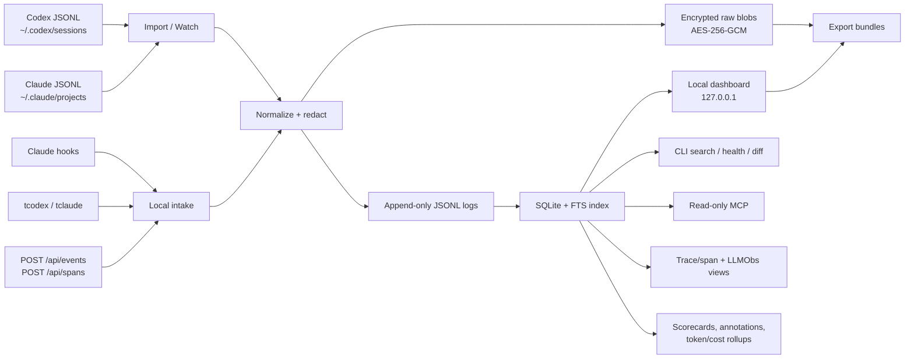

# Tracebase Architecture

Tracebase is a local-first trace collector and dashboard for coding-agent work. It keeps raw transcript events private by default, projects them into searchable local indexes, and exposes a small set of CLI, HTTP, and MCP interfaces for inspection.

## System Map

| Layer | Responsibility | Durable state |
| --- | --- | --- |
| Ingestion | Import Codex/Claude JSONL, poll transcript folders, accept explicit live intake, record wrapper metadata | `index.jsonl`, `sessions.jsonl`, encrypted `blobs/*.json` |
| Indexing | Normalize events, build searchable session/event/span projections, support dashboard filters | `traces.sqlite` |
| Dashboard/API | Serve local UI, read-only trace views, exports, summaries, and opt-in intake | Built `dist/` assets plus HTTP handlers |
| Intelligence | Derive annotations, context-waste findings, token/cost rollups, run scorecards, and incident packet diagnostics | Append-only logs plus rebuildable SQLite tables |
| Integrations | CLI commands, stdio MCP tools, bootstrap docs, shell wrappers, launchd watcher | Local config/docs only |

## Storage Model

- Append-only JSONL logs are the durable audit trail for indexed metadata.
- AES-256-GCM encrypted blobs are the durable raw event store.
- SQLite plus FTS5 is a rebuildable query index for fast dashboard and CLI search.
- Canonical trace/span tables project each session into a trace with a root span and transcript-visible child spans.
- Structured metadata extracted from transcript-visible events captures safe redacted fields such as model, token counts, estimated cost, tool name, command/file hints, approval state, and error kind; full raw payloads remain encrypted blobs.

This keeps capture resilient: if SQLite is deleted or corrupted, it can be rebuilt from local append-only logs and encrypted blobs.

## Ingestion Paths

| Path | Command/API | Notes |
| --- | --- | --- |
| Historical backfill | `traces import` | Scans known Codex and Claude transcript directories. |
| Fixture/import file | `traces import-file <provider> <file>` | Deterministic import for testing or one-off files. |
| Watch mode | `traces watch` / `traces watch-install` | Polls recent transcript changes; launchd support on macOS. |
| Claude hooks | `traces hook` | Reads hook JSON from stdin. |
| Wrappers | `tcodex`, `tclaude` | Records invocation start/end metadata around local CLIs. |
| Live intake | `traces agent`, `POST /api/events`, `POST /api/spans` | Disabled in plain `serve` mode unless explicitly enabled. |

All ingestion is idempotent by event id or content hash.

## Interfaces

| Interface | Default posture | Purpose |
| --- | --- | --- |
| CLI | Local process only | Import, inspect, export, analyze, and run health checks. |
| Dashboard | Binds to `127.0.0.1` | Browse sessions, events, traces, spans, summaries, and exports. |
| HTTP API | Read-mostly | Powers the dashboard and explicit local integrations. |
| MCP | Read-only by default | A read-only stdio MCP server lets local coding agents query traces without a network service. |

State-changing HTTP intake requires `traces agent`, `traces serve --allow-intake`, or `TRACEBASE_ALLOW_INTAKE=1`. The OSS MCP server is read-only.

## Security Boundaries

- The dashboard binds to loopback by default.
- Non-loopback serving requires `--allow-remote` or `TRACEBASE_ALLOW_REMOTE=1`.
- State-changing browser requests must come from the same loopback origin.
- Raw exports require explicit local intent; HTTP raw export requires `x-tracebase-raw-export: 1`.
- Raw blob HTTP reads are disabled unless `TRACEBASE_ALLOW_RAW_BLOB_API=1`.
- Summary generation invokes only local allowlisted `codex` or `claude` runners; browser requests cannot provide arbitrary commands.
- Tracebase does not intercept network traffic or attempt to recover hidden/private model reasoning.

## Operations

| Task | Command |
| --- | --- |
| Rebuild query index | `traces index` |
| Re-run trace annotations | `traces analyze` |
| Inspect token/cost rollups | `traces costs --session-id <id>` |
| Inspect recent events | `traces recent --limit 20` |
| Inspect canonical traces | `traces traces-list` |
| Inspect spans | `traces spans --session-id <id>` |
| Compare transcript coverage | `traces trace-diff --session-id <id>` |
| Start dashboard | `traces serve --port 18427` |
| Start live intake | `traces agent --port 18427` |
| Start read-only MCP | `traces mcp` |
| Run release gate | `npm test` |

Hidden provider chain-of-thought remains out of scope unless it is explicitly present in local transcripts or hook payloads.
